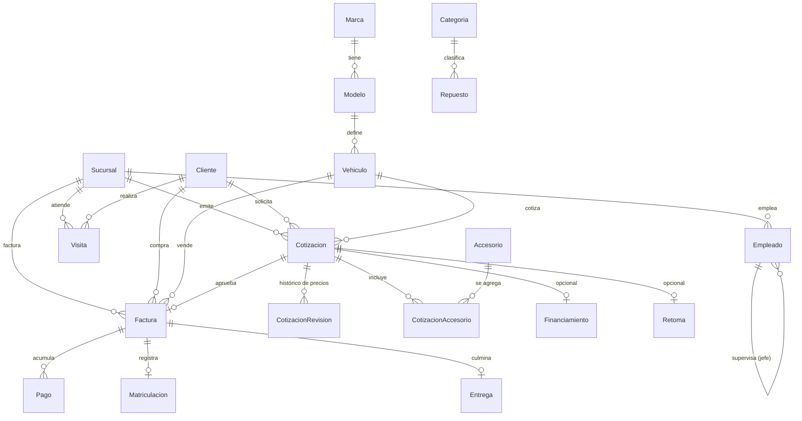

# Base de Datos Modelo: Concesionario

Base de Datos del Escenario previsto para aplicación de los conceptos abordados en Clase.

## Flujo de Negocio

El modelo sigue tres etapas del proceso comercial de la concesionaria:

### Etapa A — Recepción y atención del cliente
- El cliente llega a la sucursal y es atendido por un asesor.
- Se registra como cliente (cedula, contactos) si es nuevo.
- Se deja registro de la visita.

### Etapa B — Cotización y negociación
- **Precio:** el asesor genera una cotización del vehículo y negocia el precio final.
- **Financiamiento:** opcional, se registra el plan (inicial, plazo, tasa, cuota).
- **Accesorios:** se agregan accesorios al vehículo (pintura, alarma, garantía, etc.).
- **Retoma:** si el cliente entrega su vehículo usado, se registra el valor de retoma.
- Cada cambio de precio queda historizado.

### Etapa C — Facturación, matriculación y entrega
- Se emite la factura final.
- Se registran los pagos.
- Se matricula el vehículo (placa, entidad).
- Se entrega el vehículo al cliente (recibido por, observaciones).

### Ciclo de vida del Vehiculo
```
Disponible → Cotizado → Vendido → Entregado
```

## Diagrama E-R

